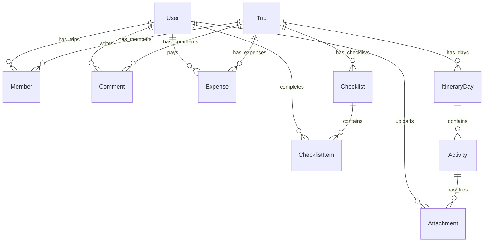

# ✈️ Collaborative Trip Planner

A premium, real-time collaborative itinerary planning platform built with the **MERN Stack** (using Postgres + Prisma in place of MongoDB). This application was developed as part of the **Cohort 26 Buildathon**, focusing on robust workflow logic, real-time synchronization, role-based access control, and seamless user experiences.

---

## 🌐 Live Demo & Repository
* **Hosted Frontend Application:** `[Insert Live Link Here]` *(e.g., Vercel or Netlify)*
* **Hosted Backend API:** https://collaborative-trip-planner-api.onrender.com
* **GitHub Repository:** `[Insert Repository Link Here]`

---

## ✨ Features Implemented

### 🗓️ Trip Planning & Day-wise Itinerary
* **Itinerary Builder:** Create trips with specific start/end dates. The app auto-generates structured days (`ItineraryDay`) for the duration of the trip.
* **Activity Cards:** Add rich, interactive activity cards to any day featuring titles, descriptions, specific times, locations, reservation/booking codes, and custom notes.
* **Inline Editing:** Edit activity details directly from the dashboard (locked/synchronized in real-time).

### 👥 Real-Time Collaboration & Presence
* **Live User Presence:** Powered by WebSockets (Socket.io). View active avatars/names of collaborators currently viewing or editing the trip in real-time.
* **Activity Editing Locks:** Live locking feedback. If another member is currently editing an activity card, it displays a typing indicator (e.g., `"John is editing..."`) and prevents conflicting updates.
* **Global Sync:** Real-time updates automatically broadcast to all active collaborators, refreshing itineraries, checklists, and expenses without needing a manual page reload.

### 🔐 Role-Based Access Control (RBAC)
Manage permissions dynamically per trip member:
* **Owner:** Full access to edit, delete, invite members, change member roles, and delete the trip.
* **Editor:** Full access to modify itineraries, activities, log expenses, update checklists, and write comments. Cannot invite new members or delete the trip.
* **Viewer:** Read-only access. Can view the itinerary, checklists, expenses, and comments. Cannot add or modify any data.

### 📋 Interactive Checklist & Todo Boards
* Organize trip preparations (e.g., *Packing List*, *Flight Bookings*, *Todo Items*).
* Mark items as completed, which records who checked it off.
* Live checkbox updates synced in real-time.

### 💰 Budget & Expense Tracker
* Log expenses with description, amount, category, and payer info.
* Supported categories: **Transport**, **Accommodation**, **Food**, **Activities**, **Shopping**, and **Other**.
* Auto-calculates metrics: **Total Spent** and **Average Expense** across the trip group.

### 💬 Threaded Comment System
* Leave comments on specific activities or general day itineraries.
* Threaded messages sync in real-time across active socket channels.

### 📁 Cloud Attachments
* Upload tickets, hotel vouchers, images, or PDFs to specific activities using **Cloudinary** integration.

---

## 🛠️ Tech Stack & Architecture

### Frontend
* **Core:** React (Vite template), Vanilla Javascript
* **Styling:** Tailwind CSS (Modern glassmorphic designs, dark mode default, fluid animations)
* **Real-time:** Socket.io-client
* **Icons:** Lucide React
* **State & Network:** Axios + React Context API (Auth & Session management)

### Backend
* **Core:** Node.js, Express
* **Database Access:** Prisma ORM (v5.15.0)
* **Database:** PostgreSQL (Hosted on Neon)
* **Real-time Server:** Socket.io
* **Authentication:** JWT (JSON Web Tokens) & Bcryptjs for secure password hashing
* **File Uploads:** Multer + Cloudinary SDK

---

## 🗄️ Database Schema Design

The database schema is constructed in PostgreSQL via Prisma. Here is an overview of the data models and relationships:



### Models Summary:
* **User:** Stores credentials, email (unique), and association collections.
* **Trip:** Holds core trip info, start/end dates, and Cascading relations for itinerary days, checklists, expenses, and comments.
* **Member:** Joint table linking `User` and `Trip` with specific role configurations (`owner`, `editor`, `viewer`).
* **ItineraryDay:** Groups activities by specific calendar days.
* **Activity:** Custom tasks containing timing, location, reservation codes, and file attachments.
* **Checklist / ChecklistItem:** Lists of todos tied to the trip, tracking who marked items complete.
* **Expense:** Financial transaction entries tracking details, amount, category, and payer.
* **Comment:** Threaded logs associated with a specific trip, optionally linked to an itinerary day or a specific activity.

---

## 🚀 Local Setup & Installation

Follow these steps to configure the project locally on your machine.

### Prerequisites
* **Node.js** (v18+ recommended)
* **npm** or **yarn**
* A running **PostgreSQL** database (e.g., local server or a free tier on Neon.tech)

---

### Step 1: Clone the Repository
```bash
git clone <your-repository-url>
cd Buildathon
```

---

### Step 2: Server Configuration & Start
1. Navigate to the `server` directory:
   ```bash
   cd server
   ```
2. Install backend dependencies:
   ```bash
   npm install
   ```
3. Create a `.env` file inside the `server/` directory:
   ```env
   PORT=5000
   DATABASE_URL="postgresql://<username>:<password>@<host>/<database>?sslmode=require"
   JWT_SECRET="your_jwt_secret_key"
   CLOUDINARY_CLOUD_NAME="your_cloudinary_cloud_name"
   CLOUDINARY_API_KEY="your_api_key"
   CLOUDINARY_API_SECRET="your_api_secret"
   CLIENT_URL="http://localhost:5173"
   ```
4. Run Prisma commands to generate client libraries and run database migrations:
   ```bash
   # Generate Prisma Client
   npx prisma generate
   
   # Run migrations to set up database schemas
   npx prisma db push
   ```
5. Start the backend development server:
   ```bash
   npm run dev
   ```
   The backend will start running on `http://localhost:5000`.

---

### Step 3: Client Configuration & Start
1. Open a new terminal window and navigate to the `client` directory:
   ```bash
   cd client
   ```
2. Install frontend dependencies:
   ```bash
   npm install
   ```
3. Create a `.env` file inside the `client/` directory (optional, if customizing the API location):
   ```env
   VITE_API_URL="http://localhost:5000"
   ```
4. Start the frontend development server:
   ```bash
   npm run dev
   ```
   The client will open in your browser, typically running on `http://localhost:5173`.

---

## 🔌 WebSocket Events Reference

Real-time synchronization relies on the following Socket.io channels:

| Event Name | Direction | Payload | Description |
| :--- | :--- | :--- | :--- |
| `join-trip` | Client -> Server | `{ tripId, user }` | Joins the room for a specific trip and logs active presence. |
| `presence-update` | Server -> Client | `[ { id, name } ]` | Broadcasts the list of online users in the current trip. |
| `editing-activity` | Client -> Server | `{ tripId, activityId, userName }` | Signals that a user has started editing a specific activity card. |
| `user-editing` | Server -> Client | `{ activityId, userName }` | Alerts other room users to lock editing on the target activity card. |
| `stop-editing-activity` | Client -> Server | `{ tripId, activityId }` | Signals that editing has finished and locks can be released. |
| `user-stop-editing` | Server -> Client | `{ activityId }` | Unlocks the activity card UI for all other room users. |
| `trip-updated` | Client <=> Server | `{ tripId }` | Broadcasts a refresh trigger for any data changes (Itinerary, checklist, expense, etc.). |
| `new-comment` | Client <=> Server | `{ tripId, comment }` | Direct socket broadcast of newly added comments. |
